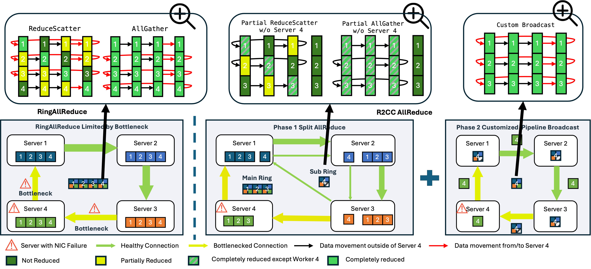

# R<sup>2</sup>CCL: Reliable and Resilient Collective Communication

## Overview
R<sup>2</sup>CCL is a fault tolerant communication library that provides lossless, low overhead failover by exploiting multi-NIC hardware. It is designed as a drop in replacement for NCCL to minimize full job terminations from network failures.

## Features
🔥 **Zero-Downtime Hot Repair**: Automatically detects and mitigates network failures mid-collective. By utilizing multi-NIC GPU buffer registration and DMA-buffer rollback, R2CC live-migrates failed connections to backup links without losing in-flight data.

⚖️ **Topology-Aware Load Balancing (R2CC-Balance)**: After a failure, R2CC dynamically redistributes traffic across the remaining healthy NICs. It is fully aware of PCIe, NUMA, and NVLink (PXN) topology to maximize remaining bandwidth.

🚀 **Failure-Optimized AllReduce (R2CC-AllReduce)**: Introduces a novel schedule that prevents degraded servers from bottlenecking the cluster by intelligently combining global and partial AllReduce operations.

<p align="center"></p><br/>

## Demo
https://github.com/user-attachments/assets/8511cbf4-843a-4399-a742-d986eac55eb9

## Todo List
1. Live Migration: Seamless failover via multi-NIC registration and DMA rollback. ✔️
2. R<sup>2</sup>CCL-Balance: Load-balancing for remaining healthy interfaces. ✔️
3. Simulated R<sup>2</sup>CCL-AllReduce: Performance-equivalent implementation via AllReduce + Broadcast ✔️
4. Clean up legacy code and add examples / test scripts for common platforms.
5. Native implementation of R<sup>2</sup>CCL-AllReduce with customized kernel.
6. Optimization: Further performance tuning.

## How to use R<sup>2</sup>CCL
### Build
```shell
git clone https://github.com/WWeiOne/R-2CCL.git
cd R-2CCL
make -j
```

### Test
Similar to NCCL, R<sup>2</sup>CCL can be benchmarked using nccl-tests. Below we provide compilation commands for nccl-tests and an example of performance testing using allreduce.

### Build nccl-tests
```shell
git clone https://github.com/NVIDIA/nccl-tests.git
cd nccl-tests
make
mpirun -np 4 -host A,B ./build/all_reduce_perf -b 8K -e 8G -f 2 -t 1 -g 1 
```

### Testing with Environment Variables
To simplify testing the performance and reduce the complexity of triggering failures (e.g., using SmartNICs to disable specific routing at runtime), we provide environment variables to directly simulate specific scenarios and measure performance.

**R2CC_MODE**:
- `0`: NCCL baseline
- `1`: Live Migration
- `2`: R<sup>2</sup>CCL-Balance
- `3`: R<sup>2</sup>CCL-AllReduce

### Example1: Live Migration
Test Migration Performance.
Requirements: 2 nodes, >=2 NICs per node.
```shell
# no failure
mpirun -x -np 4 -host A,B ./build/all_reduce_perf -b 8K -e 8G -f 2 -t 1 -g 1

# 1 failure
mpirun -x R2CC_MODE=1  -np 4 -host A,B ./build/all_reduce_perf -b 8K -e 8G -f 2 -t 1 -g 1

# or run the first command and disable the routing
```

### Example2: Failure Aware Scheduling Performance
When only one NIC remains on each node, the performance of different strategies is identical. Therefore, we recommend using machines with 8 NICs and 8 GPUs for testing. Below are the performance tests for R<sup>2</sup>CCL-Balance and R<sup>2</sup>CCL-AllReduce, respectively.
```shell
mpirun -x R2CC_MODE=2  -np 16 -host A,B ./build/all_reduce_perf -b 8K -e 8G -f 2 -t 1 -g 1 

mpirun -x R2CC_MODE=3  -np 16 -host A,B ./build/all_reduce_perf -b 8K -e 8G -f 2 -t 1 -g 1 
```

## Citation
```
@article{wang2025reliable,
  title={Reliable and Resilient Collective Communication Library for LLM Training and Serving},
  author={Wang, Wei and Yu, Nengneng and Xiong, Sixian and Liu, Zaoxing},
  journal={arXiv preprint arXiv:2512.25059},
  year={2025}
}
```
