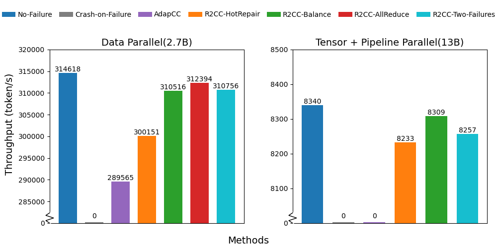
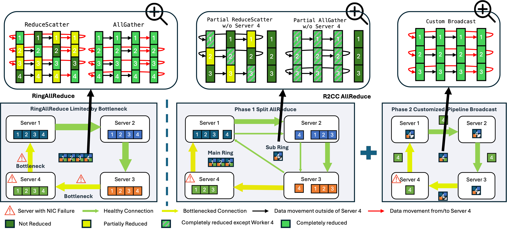

# To Artifact Evaluation Reviewers

## Latest Server Availability Update (September 10, 2026)

We have secured a two-node, BF2-equipped CloudLab `r7525` allocation for the evaluation. It is available until **September 22, 2026, 6:24 AM ET**. The SSH key and the login instructions are provided to the evaluators through HotCRP. The environment on both nodes is fully set up, so no instantiation or setup steps are needed. The six ready-to-run tests, all run commands, the logs of our own runs on this testbed and the analysis of the results are in [examples/cloudlab_r7525/README.md](./examples/cloudlab_r7525/README.md).

## Artifact and Testbed

R2CC is a fault-tolerant communication library designed for multi-NIC environments. Evaluating its core functionality requires at least two GPU servers equipped with multiple network interfaces.

The full performance evaluation in our paper was conducted on a rented multi-node H100 cluster with eight GPUs per server. Due to the cost and temporary nature of this platform, we cannot provide continuous access to it throughout the Artifact Evaluation period.

R2CC was primarily developed and tested on Clemson `r7525` nodes in CloudLab, including experiments involving real NIC failures. For this Artifact Evaluation, we provide a public CloudLab profile and a pre-built image containing the R2CC source code, dependencies, and experiment scripts. When the required nodes are available, evaluators can use them to quickly instantiate the environment and reproduce the experiment.

After successfully instantiating the provided profile on two BF2-equipped `r7525` nodes, evaluators can reproduce the real NIC-failure and experiment shown in the video below by running three environment-setup scripts and one experiment script.

For the complete experimental design and reproduction instructions for the `r7525` platform, please refer to [`examples/cloudlab_r7525/README.md`](./examples/cloudlab_r7525/README.md).

## Platform and Availability

The Clemson `r7525` is currently the only CloudLab node type equipped with multi-NIC and GPU. Due to hardware and firmware issues affecting its BlueField-2 SmartNICs, only 6 of the original 15 `r7525` nodes remain equipped with BF2 SmartNICs, which have 3 NIC ports per server. See the [CloudLab announcement regarding the `r7525` nodes](https://www.cloudlab.us/portal-news.php?idx=138).

Importantly, CloudLab advance reservation only reserves `r7525` nodes; it does not guarantee that the reserved nodes will be equipped with BF2. Access to the required multi-NIC configuration therefore depends on BF2 availability at experiment instantiation time. If no BF2-equipped nodes are available, the provided CloudLab profile cannot be instantiated.

For evaluators with CloudLab access, we recommend requesting an `r7525` reservation at least two weeks in advance because these nodes are highly contended. A CloudLab reservation can typically cover up to approximately 14 days.

We will also make every effort to reserve the required machines and provide access to evaluators. We will keep the availability information below up to date.

# Original README

# R2CC: Reliable and Resilient Collective Communication

## Overview
R<sup>2</sup>CCL is a fault tolerant communication library that provides lossless, low overhead failover by exploiting multi-NIC hardware. It is designed as a drop in replacement for NCCL to minimize full job terminations from network failures.

📢 **Update 02/23/2026:** Added a CloudLab image and public profile for quick reproduction — see [Demo](#demo).

<p align="center">
  <br/>
  <b>Megatron Training Performance Evaluation</b>
</p>

## Features
🔥 **Zero-Downtime Hot Repair**: Automatically detects and mitigates network failures mid-collective. By utilizing multi-NIC GPU buffer registration and DMA-buffer rollback, R2CC live-migrates failed connections to backup links without losing in-flight data.

⚖️ **Topology-Aware Load Balancing (R2CC-Balance)**: After a failure, R2CC dynamically redistributes traffic across the remaining healthy NICs. It is fully aware of PCIe, NUMA, and NVLink (PXN) topology to maximize remaining bandwidth.

🚀 **Failure-Optimized AllReduce (R2CC-AllReduce)**: Introduces a novel schedule that prevents degraded servers from bottlenecking the cluster by intelligently combining global and partial AllReduce operations. The current implementation builds the schedule from NCCL collectives on sub-communicators: an AllReduce of the first (1−X) of the data on all ranks, a partial AllReduce of the remaining X on the healthy servers, and a pipelined Reduce-to-helper + Broadcast of that tail back to the degraded server (X = lost bandwidth fraction).

<p align="center"></p><br/>

## Demo
https://github.com/user-attachments/assets/8511cbf4-843a-4399-a742-d986eac55eb9

We provide a pre-built CloudLab image, the test scripts and the logs of running them, so the demo and the other experiments can be reproduced on two r7525 servers:
- [Setup guide](./examples/cloudlab_r7525/r7525_setup.md) — instantiate the profile with the pre-built image, flash the SmartNICs, dump the topology.
- [Experiments](./examples/cloudlab_r7525/README.md) — six ready-to-run tests.
- [Logs](./examples/cloudlab_r7525/logs) — the terminal output of running these experiments on CloudLab, one run per test.

## Todo List
1. Live Migration: Seamless failover via multi-NIC registration and DMA rollback. ✔️
2. R<sup>2</sup>CCL-Balance: Load-balancing for remaining healthy interfaces. ✔️
3. R<sup>2</sup>CCL-AllReduce: Correct implementation on top of NCCL sub-communicators (partial AllReduce on the healthy servers + pipelined Reduce/Broadcast of the tail), verified with nccl-tests `-c 1` and real NIC disconnects. ✔️
4. CloudLab r7525 examples and test scripts. ✔️
5. Native implementation of R<sup>2</sup>CCL-AllReduce with a customized kernel (single-pass Stage 2).

## Test scripts and results
We provide a complete set of test scripts and the results of running them in [examples/cloudlab_r7525](./examples/cloudlab_r7525): hot repair of a real NIC failure (injected at runtime with an OVS drop rule on the BlueField SmartNIC) followed by R<sup>2</sup>CCL-Balance or R<sup>2</sup>CCL-AllReduce, and nccl-tests correctness/bandwidth runs of plain NCCL, Balance and R<sup>2</sup>CCL-AllReduce. Each script saves its terminal output; the saved run of every test is in [examples/cloudlab_r7525/logs](./examples/cloudlab_r7525/logs). See [examples/cloudlab_r7525/README.md](./examples/cloudlab_r7525/README.md) for the scripts, the annotated results and the testbed caveats, and [r7525_setup.md](./examples/cloudlab_r7525/r7525_setup.md) for setting up the two CloudLab servers.

## How to use R<sup>2</sup>CCL
### Build
```shell
git clone https://github.com/r2cc-project/R-2CCL.git
cd R-2CCL
make -j
```

### Test
Similar to NCCL, R<sup>2</sup>CCL can be benchmarked using nccl-tests. Below we provide compilation commands for nccl-tests and an example of performance testing using allreduce.

### Build nccl-tests
```shell
git clone https://github.com/NVIDIA/nccl-tests.git
cd nccl-tests
make MPI=1 MPI_HOME=<openmpi> NCCL_HOME=<R-2CCL>/build
mpirun -np 4 -host A,B ./build/all_reduce_perf -b 8K -e 8G -f 2 -t 1 -g 1 -c 1
```

### Testing with Environment Variables
To simplify testing the performance and reduce the complexity of triggering failures (e.g., using SmartNICs to disable specific routing at runtime), we provide environment variables to directly simulate specific scenarios and measure performance. All variables must be identical on every rank (pass them with `mpirun -x`); the library cross-checks them and warns on mismatches.

**R2CC_MODE**:
- `0`: NCCL baseline
- `1`: Live Migration (static backup connection)
- `2`: R<sup>2</sup>CCL-Balance
- `3`: R<sup>2</sup>CCL-AllReduce

**Failure model for modes 2/3** (no real failure is injected):
- `R2CC_FAILED_HCA=<name|index>[,…]`: NIC(s) considered failed (default: the last `R2CC_FAILED_NIC_COUNT` NICs).
- `R2CC_FAILED_NODE=<n>`: server whose NICs failed (default 0).

**R2CC-AllReduce knobs** (mode 3): `R2CC_AR_STAGE2_CHUNKS` (pipeline depth, default 4), `R2CC_AR_SCHEDULE` (0 all stages concurrent, 1 Stage 2 after Stage 1, 2 also serialize the partial AllReduce — default, 3 also serialize Reduce/Broadcast chunks), `R2CC_AR_MIN_BYTES` (below this AllReduce falls back to Balance, default 16 MiB).

**After a real hot repair**: `R2CC_AR_AFTER_REPAIR=2|3` selects Balance (default) or R2CC-AllReduce for the collectives that follow the repair.

**Failover trigger**: `NCCL_R2CC_FAILOVER_TIMEOUT_MS` (default 5000). A connection whose posted sends show no completion for this long is failed over to its backup path even if the NIC reports no error (a black-holed RoCE path); `<= 0` disables the timer and failover then relies on the IB retry timeout alone (`NCCL_IB_TIMEOUT` x `NCCL_IB_RETRY_CNT`).

### Example1: Live Migration
Test Migration Performance.
Requirements: 2 nodes, >=2 NICs per node.
```shell
# no failure
mpirun -np 4 -host A,B ./build/all_reduce_perf -b 8K -e 8G -f 2 -t 1 -g 1

# 1 failure (static backup connection)
mpirun -x R2CC_MODE=1 -np 4 -host A,B ./build/all_reduce_perf -b 8K -e 8G -f 2 -t 1 -g 1

# or run the first command and disable the routing on the SmartNIC (see the CloudLab example)
```

### Example2: Failure Aware Scheduling Performance
When only one NIC remains on each node, the performance of different strategies is identical. Therefore, we recommend using machines with 8 NICs and 8 GPUs for testing. Below are the performance tests for R<sup>2</sup>CCL-Balance and R<sup>2</sup>CCL-AllReduce, respectively (NIC `mlx5_7` of server 0 assumed failed).
```shell
mpirun -x R2CC_MODE=2 -x R2CC_FAILED_NODE=0 -x R2CC_FAILED_HCA=mlx5_7 -np 16 -host A,B ./build/all_reduce_perf -b 8K -e 8G -f 2 -t 1 -g 1 -c 1

mpirun -x R2CC_MODE=3 -x R2CC_FAILED_NODE=0 -x R2CC_FAILED_HCA=mlx5_7 -np 16 -host A,B ./build/all_reduce_perf -b 8K -e 8G -f 2 -t 1 -g 1 -c 1
```

## Citation
```
@article{wang2025reliable,
  title={Reliable and Resilient Collective Communication Library for LLM Training and Serving},
  author={Wang, Wei and Yu, Nengneng and Xiong, Sixian and Liu, Zaoxing},
  journal={arXiv preprint arXiv:2512.25059},
  year={2025}
}
```
