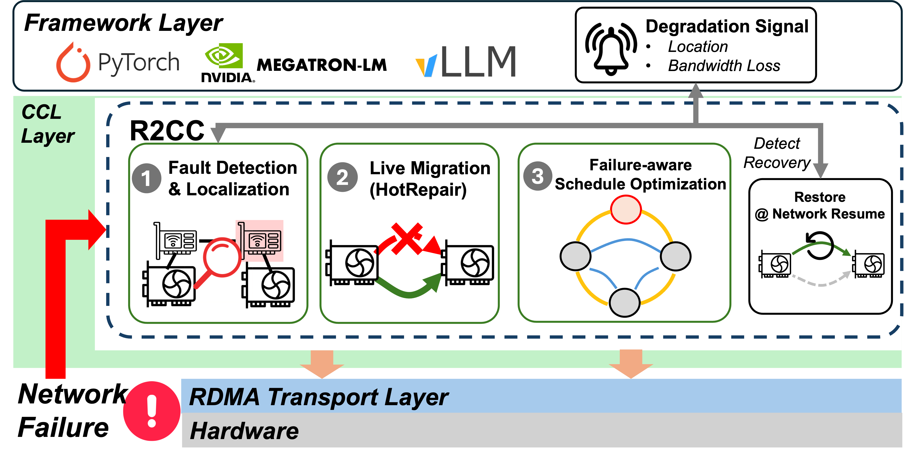
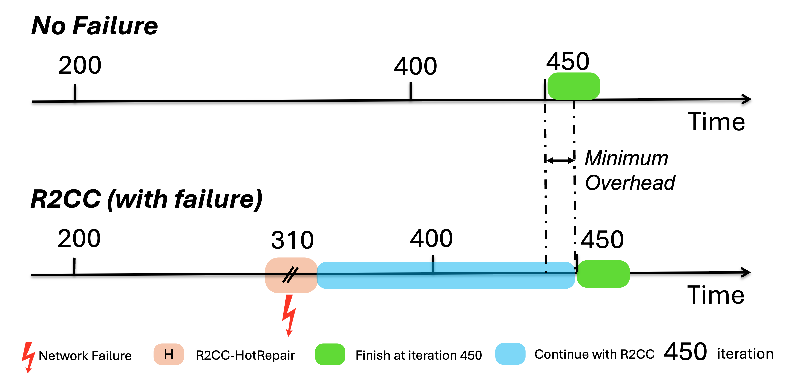
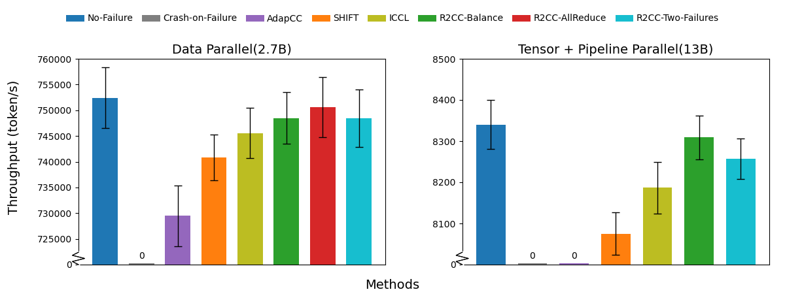
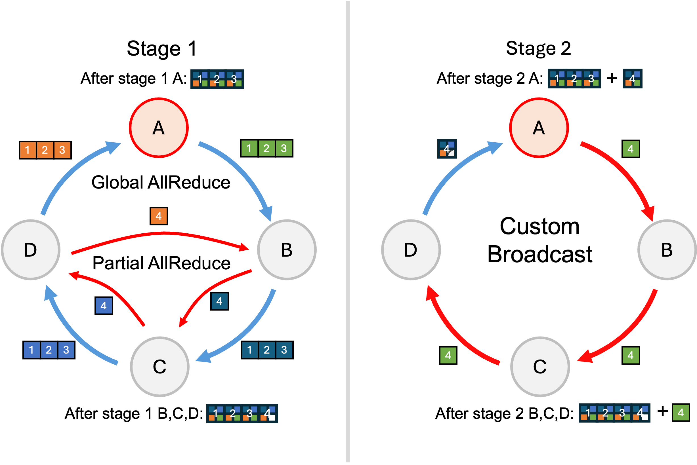

# R2CC: Reliable and Resilient Collective Communication

**Keep GPU jobs running through network failures.**

NSDI '27 · [Paper](https://arxiv.org/abs/2512.25059) · [Demo](#demo) · [Getting started](#getting-started) ·
[Experiments](./examples/cloudlab_r7525/README.md)

A failed NIC or link should not force a job on healthy GPUs to restart. R<sup>2</sup>CCL repairs failed network
paths while collective operations are still running. When the GPUs are healthy and another network path remains, it
completes the interrupted operation without restarting the job, then redistributes the traffic and adapts the
AllReduce schedule to the remaining bandwidth.

**In the paper's H100 evaluation, R2CC adds less than 1.1% overhead to training and less than 3% to inference under a NIC failure.**

<p align="center">
  <br/>
  <b>R2CC detects failures, repairs in-flight transfers and adapts collective schedules in the communication layer</b>
</p>

## Demo

https://github.com/user-attachments/assets/8511cbf4-843a-4399-a742-d986eac55eb9

<details>
<summary>R2CC (with failure) vs. Ideal (failure-free)</summary>
<p align="center">
  <br/>
  <b>R2CC (with failure) vs. Ideal (failure-free)</b>
</p>
</details>

On three CloudLab servers, tests [01](./examples/cloudlab_r7525/01.hot_repair_to_balance.sh) and
[02](./examples/cloudlab_r7525/02.hot_repair_to_r2cc_allreduce.sh) run ten 4 GiB AllReduces and cut the NIC `mlx5_2`
of node-1 in the middle of the third. That AllReduce still completes, and every element of all ten results is
correct. The data each server receives per AllReduce ([log](./examples/cloudlab_r7525/logs/rx_per_node.log)) shows
what the two schedules do after the cut.

| MiB received per AllReduce | node-1 (lost `mlx5_2`) | node-2 | node-3 |
|---|---|---|---|
| Healthy | 7032 | 7032 | 7032 |
| R2CC-Balance after the cut | 7078 | 7078 | 7078 |
| R2CC-AllReduce after the cut | 6150 | 8230 | 8218 |

R2CC-Balance spreads node-1's traffic over its two remaining NICs. R2CC-AllReduce reduces the traffic node-1
receives by 13% relative to R2CC-Balance, and the healthy servers take on more communication over their full set of NICs instead.

## Results

The paper evaluates R2CC on four servers, each with eight H100 GPUs and eight 400 Gb/s InfiniBand NICs, with one
NIC failed, which removes 12.5% of that server's bandwidth.

- **Overhead against a failure-free run.** Less than 1.1% for training and less than 3% for inference.
- **Against existing fault-tolerant systems.** R2CC reduces the failure-induced overhead by up to 92% for training
  and up to 98% for inference.

<p align="center">
  <br/>
  <b>Megatron-LM training throughput with a failed NIC</b><br/>
  With data parallelism over 32 GPUs, R2CC-AllReduce keeps 750,627 tokens/s against 752,405 without a failure (0.24%
  overhead), while vanilla NCCL crashes.
</p>

## How it works

R2CC handles a failure in three steps, each building on the previous one.

1. **Detect and localize.** R2CC notices a failed path from transport errors, or from sends that stop completing
   when the NIC reports no error. It tells the peer over an out-of-band channel, and all ranks agree on which NIC
   failed.
2. **Repair in flight (HotRepair).** GPU buffers are registered with several NICs in advance. The two endpoints
   agree on a protocol-aware replay boundary, which also holds for NCCL's low-latency LL and LL128 protocols, and
   only the unfinished part is resent over a backup connection. The running collective completes with correct
   results instead of starting over.
3. **Adapt the schedule.** The backup NIC now carries extra traffic and becomes the bottleneck. R2CC-Balance spreads
   the failed NIC's share over all remaining NICs of the server. For AllReduce, the server that lost bandwidth
   still sets the pace, because every server in a ring moves the same amount of data. R2CC-AllReduce reduces the
   communication load on that server, as shown below.

### How R2CC-AllReduce reduces the load of the degraded server

R2CC-AllReduce runs a global AllReduce on one part of the tensor while the healthy servers reduce the remaining part
in parallel. The degraded server's contribution to that remaining part is then combined with the partial result and
distributed to all ranks.

<p align="center">
  <br/>
  <b>R2CC-AllReduce reduces communication on the degraded node</b><br/>
  Illustrated for four nodes with 25% bandwidth loss, where the degraded node's load drops from 2D to 7D/4.
</p>

## Capabilities and validated integrations

| Capability / integration | Validated by | Scope |
|---|---|---|
| nccl-tests | This repo, [tests 03–07](./examples/cloudlab_r7525/README.md#33-test-03--nccl-tests-correctness-and-a-side-by-side-table) | AllReduce from 8 B to 4 GiB, in place and out of place, results checked at every size |
| CUDA Graphs | This repo, [test 08](./examples/cloudlab_r7525/README.md#36-test-08--cuda-graphs) | Correct replay through a failure, and a re-capture enables the optimized schedule\* |
| PyTorch DDP | This repo, [test 09](./examples/cloudlab_r7525/README.md#37-test-09--training-through-a-nic-failure) | GPT-2 training through a persistent NIC failure, with gradients, parameters, loss and perplexity checked |
| Megatron-LM | [Paper](https://arxiv.org/abs/2512.25059) | Data-parallel (2.7B) and tensor plus pipeline parallel (13B) training |
| vLLM | [Paper](https://arxiv.org/abs/2512.25059) | Serving with a NIC failure (TTFT and TPOT) |
| AllGather, ReduceScatter, SendRecv | [Paper](https://arxiv.org/abs/2512.25059) | R2CC-Balance keeps 83–90% of the healthy throughput for large messages |

\* R2CC-AllReduce needs one eager AllReduce before its schedule is captured for the first time.

Each row is validated in the setting it names, not for every framework version or deployment.

## Getting started

```shell
git clone https://github.com/r2cc-project/R-2CCL.git
cd R-2CCL
make -j                                                        # builds build/lib/libnccl.so, based on NCCL 2.23.4
export LD_LIBRARY_PATH="$PWD/build/lib:${LD_LIBRARY_PATH:-}"   # for programs that load libnccl.so dynamically
```

Some frameworks ship their own NCCL, so check that the process actually maps this `libnccl.so` (for example in
`/proc/<pid>/maps`, as test 09 does). HotRepair needs servers with several RDMA NICs, so that a failed path has a
backup. With that in place, failover needs no extra setting, and the collectives after a repair use R2CC-Balance,
or R2CC-AllReduce with `R2CC_AR_AFTER_REPAIR=3`. To run the tests, set up three CloudLab r7525 servers with
[r7525_setup.md](./examples/cloudlab_r7525/r7525_setup.md) and run the scripts in
[examples/cloudlab_r7525](./examples/cloudlab_r7525/README.md) from node-1, starting with
`./01.hot_repair_to_balance.sh`.

## Experiments

[examples/cloudlab_r7525](./examples/cloudlab_r7525/README.md) runs nine tests on three CloudLab r7525 servers, each
with a reference log. Tests 01, 02, 08 and 09 cut a real NIC in the middle of the run by dropping its traffic on the
BlueField SmartNIC. Tests 01, 02 and 08 check every element of every AllReduce, and tests 03–07 check the result at
every message size with nccl-tests. In the 4 GiB K sweep of test 07, the normalized completion
times agree within 1% with the paper's formulas applied to this testbed's six-rank ring and finite pipeline depth.

## Citation
```
@article{wang2025reliable,
  title={Reliable and Resilient Collective Communication Library for LLM Training and Serving},
  author={Wang, Wei and Yu, Nengneng and Xiong, Sixian and Liu, Zaoxing},
  journal={arXiv preprint arXiv:2512.25059},
  year={2025}
}
```
